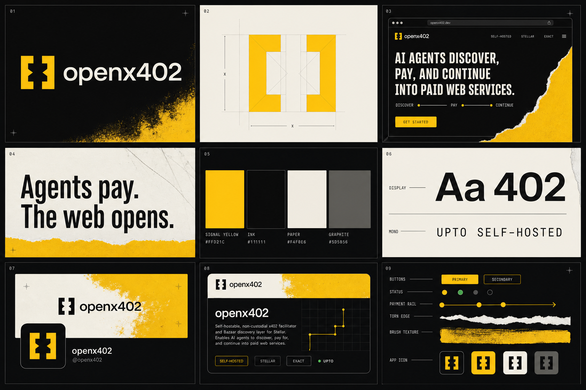

# openx402 brand direction



## Brand idea

**Payment clears. The path opens.**

openx402 is open payment infrastructure for the agentic web: discover a paid service, settle on Stellar, continue. The identity turns that sequence into an **open gate**. Two opposing modules create a forward passage; their negative space hints at `x` without becoming a literal protocol diagram.

Audience: protocol engineers, agent builders, self-host operators, and open-source contributors.

Personality: open, exact, energetic, auditable, builder-native, culturally sharp.

Primary line: **Agents pay. The web opens.**

Supporting sequence: `DISCOVER → PAY → CONTINUE`

## Logo

Use the bracket/X gate mark from the approved overview with the lowercase wordmark `openx402`. This geometry is canonical. The mark may stand alone for avatars, favicons, status badges, and small UI.

The canonical wordmark is **Archivo Variable SemiBold 600 at 100% width**, with `-0.005em` tracking. Delivery SVGs contain outlines, so no fallback font can alter the logo.

- Keep clear space equal to one quarter of the mark width.
- Minimum digital size: 16 px for the mark; 96 px for mark plus wordmark.
- Preferred colorways: yellow on ink, ink on yellow, ink on paper.
- Never redraw, widen, compress, round, or reinterpret the gate geometry.
- Do not add Stellar's mark, stars, coins, chain links, shields, or glow effects.

Canonical sources: [`mark-yellow.svg`](./logo/svg/mark-yellow.svg) and [`lockup-primary-dark.svg`](./logo/svg/lockup-primary-dark.svg). The wordmark is outlined, so SVG rendering does not depend on installed fonts. See [`ASSET_MANIFEST.md`](./ASSET_MANIFEST.md) for every variant.

## Color

| Token | Hex | Job |
| --- | --- | --- |
| Signal Yellow | `#FFD21C` | action, progress, selected state, painted field |
| Ink | `#111111` | infrastructure canvas, primary text on yellow/paper |
| Paper | `#F4F0E6` | open space, long-form reading, warm contrast |
| Graphite | `#5D5B56` | metadata, inactive control, construction lines |

Core accessible pairs: yellow/ink `13.03:1`, paper/ink `16.59:1`, paper/graphite `5.96:1`, yellow/graphite `4.68:1`. Avoid paper text on yellow and graphite text on ink.

Product status colors may appear only as tiny semantic indicators. They are not campaign colors.

Implementation tokens: [`tokens.css`](./tokens.css)

## Typography

- Wordmark: **Archivo Variable**, width `100`, weight `600`, tracking `-0.005em`.
- Primary: **Archivo Variable**. Use width `75–85`, weight `650–750` for display; width `100`, weight `400–600` for body/UI.
- Technical: **IBM Plex Mono**, weights `400–500`, uppercase labels with `0.10–0.14em` tracking.
- Headlines: tight, blunt, 0.88–0.95 line-height, slightly negative tracking.
- Body copy: 16–20 px, 1.5 line-height, 55–70 characters per line.
- Monospace is metadata, never paragraph copy.

## Texture system

The identity combines clean protocol geometry with physical evidence of making.

1. Yellow brush field: use on one large surface per viewport.
2. Torn seam: use as a section transition or crop boundary, never as a card border.
3. Graphite/grid: use at 6–12% opacity behind diagrams or repository surfaces.
4. Halftone/grain: one subtle overlay at 3–6%; do not place below small text.

Texture occupies no more than one third of a composition. UI controls remain flat and crisp.

## Website direction

### Hero

- Ink canvas, 12-column grid, oversized two-line headline.
- Copy on the left or center; yellow painted field enters from one edge.
- Show one believable rail: `DISCOVER → PAY → CONTINUE` with three nodes.
- Primary CTA is yellow/ink. Secondary CTA is transparent with a paper rule.
- Mark appears once in navigation and once as a large atmospheric crop, not repeated decoratively.

Suggested copy:

```text
Agents discover.
Payments clear.
The web opens.
```

```text
Open, self-hostable x402 infrastructure for Stellar.
```

### Page rhythm

1. Hero: promise and install/get-started action.
2. Protocol rail: discover, pay, continue.
3. Product surfaces: Facilitator, Bazaar, MCP.
4. Trust block: non-custodial, audit-ready, self-hostable.
5. Proof: testnet hashes, conformance, repository activity.
6. Final yellow field: documentation or GitHub CTA.

Use square corners for structural panels. Reserve 4 px rounding for controls. Prefer 1 px rules and alignment marks over shadows. Motion should open, reveal, and advance: gate modules separate by 8–16 px, then rail nodes progress left to right. Honor `prefers-reduced-motion`.

## Social system

Keep the mark and wordmark inside the calm center. Let texture crop at the edges. Use one message per asset.

| Channel | Export | Composition |
| --- | --- | --- |
| X profile | `400×400` PNG | full square Ink background with the canonical mark at about 56% canvas occupancy; no baked circle |
| X header | `1500×500` PNG | panel 7 art direction: regenerated HD paper/yellow paint with canonical black lockup |
| GitHub social preview | `1280×640` PNG, under 1 MB | mark + wordmark, one line, three capability chips |
| Open Graph / LinkedIn link | `1200×630` PNG | panel 1 art direction: regenerated HD ink/yellow paint with a centered lockup at 66.7% canvas width |
| Feed square | `1080×1080` PNG | one claim, large mark crop, no UI mockup |
| Feed portrait | `1080×1350` PNG | campaign image or release note with torn seam |

Current platform references: [X profile/header guidance](https://help.x.com/en/managing-your-account/common-issues-when-uploading-profile-photo), [GitHub social-preview guidance](https://docs.github.com/en/repositories/managing-your-repositorys-settings-and-features/customizing-your-repository/customizing-your-repositorys-social-media-preview), and [LinkedIn image guidance](https://www.linkedin.com/help/linkedin/answer/a563309).

Sources/templates:

- Profile: [`avatar.svg`](./social/avatar.svg) / [`avatar-400.png`](./social/avatar-400.png)
- Full profile-logo set: [`social/profile/`](./social/profile/) with X, LinkedIn, GitHub, Discord, master, and alternate colorways
- X header: [`x-header.svg`](./social/x-header.svg) / [`x-header-1500x500.png`](./social/x-header-1500x500.png), with HD-generated background inspired by panel 7
- GitHub preview: [`github-social-preview.svg`](./social/github-social-preview.svg) / [`github-social-preview-1280x640.png`](./social/github-social-preview-1280x640.png)
- Open Graph: [`open-graph-1200x630.png`](./social/open-graph-1200x630.png), with HD-generated background inspired by panel 1
- Feed: [`feed-square.svg`](./social/feed-square.svg) / [`feed-portrait.svg`](./social/feed-portrait.svg)

## Asset voice

Use these campaign lines:

- Agents pay. The web opens.
- Discover. Pay. Continue.
- Open rails for paid agents.
- Self-host the paid web.
- Exact when fixed. Upto when flexible.

Avoid “revolutionary,” “frictionless,” “next-gen,” “borderless,” cosmic language, or speculative-finance language. The voice is factual, terse, and confident.

## Non-negotiables

- Yellow is signal, not wallpaper on every section.
- Texture is material, not grunge decoration.
- No generic crypto imagery.
- No purple/blue AI gradients.
- No glossy 3D coins or planets.
- No dense fake dashboards.
- No official Stellar logo fused into the openx402 mark.
- Keep all product and protocol claims technically literal.
